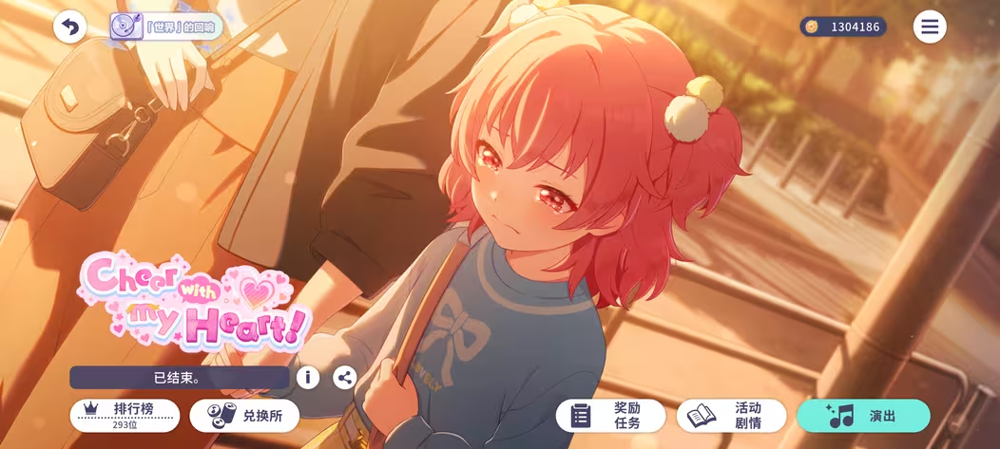

<aside>
😀 仅供个人记录，自己没有太多的时间成本去打大前排。还请大佬们轻喷。()

</aside>

<aside>
🖋️ 这应该我在国烤第3次冲榜，感谢各位共跑的群友 (此前记录: MMJWL1 桃单人 1973、桃五箱 416)。可惜以后可能没什么经历用在这个游戏上了，故写下这篇文章记录。

</aside>

<aside>
🥰

本文会尽量从新手的角度出发，给出适合新人的冲榜的一些讲解与建议。适用于想在各种活动中拿到 200-1000 名的朋友。

</aside>

# 个人排名展示

活动页

阶梯排名

相邻排名

# 冲这次箱活的原因

1. 这是我自推的箱活。
2. 牌子好看，想要牌子。
3. 太闲了没事干。(没人拿些奇怪的设备给我折腾 自己也学不进去东西)

无论你为何而来，既然你点进了这篇文章，我相信你对这件事是感兴趣的。那就来看接下来的内容吧。(笑)

# 如何冲榜

方法很简单，有玩过其它偶像音游且冲榜的朋友可以跳过这部分内容了。

## 原理 (?)

你消耗演出能量饮料 (体力/火罐) 进行演出，然后就可以获得一定量的活动积分 (PT）。你的队伍加成、综合力等越高，你就可以在一次演出中获得越多的 PT 。你投入的时间越多，你获得的 PT 总数越多。

所以说，活动积分的获取主要由以下几项事项决定: 

1. 你在冲榜上花费的有效时间。
2. 角色的养成情况。这决定了卡牌综合力与加成。以及实效等 (这部分后面再说)。

## 如何有效利用时间?

**加入共跑群或车站。**

我个人是不大推荐直接在自由房间或者高级房间匹配然后一直打歌的。在这个过程中，你会遇到各种各样不同的人，选择的曲目不同，队友的实效不同，都会为打歌的收益带来不小的影响，在重复进房退房的过程中也会导致时间的浪费。

为了使我们的收益最大化，有人就挑出了 ”效率曲” 与 ”效益曲” 。演奏它们能够让我们在单位时间内获得更多的 PT 数，或者在消耗相同体力的情况下获得更多的 PT 数。

> “效率曲”: 在单位时间内能够获得较多 PT 量的曲子。典型的是孑然妒火 (简称虾/🦐)。
> 

> “效益曲”: 消耗同样体力的情况下能够获得较多 PT 量的曲子。典型的是 Lost and Found (简称龙/🐉)、Sage (简称萨/🍕)。
> 

为什么不直接在自由房或高级房演奏这些曲目呢? 原因也很简单，它们被选取的次数相对于普通曲目较高，有相当一部分玩家不喜欢游玩这些曲目，他们看到后可能会做出包括但不限于停留到最后一刻、炸房、跳车等举措，这也会降低我们的实际收益。以及前面提到的实效问题，虽然这并不是主要的影响因素。

综上所述，如果你要在某个活动、或某个团体的活动取得较高排名，不妨换一种思路。去找当期活动或者这个团体的共跑群加入，或者加入车站。群的获取方式可以看排名最靠前几个人的名片或者自介，多半会提及类似的信息。

至于剩下的 (如黑话等等) ，你可以在对应群里自行找到需要的信息，初看可能会有点不知所云，但了解后就很清晰了，这里给出一部分我用到的。

> 常见房间信息格式: ***** (五位数房间号) + 🐉/🦐/🍕 (这个房间要打的歌曲) + *** (通常为实效要求)
> 

> 实效 (倍率) 在日常演出中影响不大，但作为一个能影响队友获得 PT 数目的因素，在加房间的时候可能需要你达到指定要求才能进入。计算可以发送给共跑群内的机器人获取。(如: 倍率 110 120 135 110 100) 分别对应你编队五张卡属性中的得分提高 ***% 中的数字，注意第一个一定要是队长。
> 

> 控分: 不在此文的讨论范围内。可以自行前往群内了解，熟悉用法可使用 [活动Pt计算器 | Haruki工具箱](https://haruki.seiunx.com/pt-calculator) 进行计算。自己也未在近期的两次活动中控出理想的分数。所以这篇文章只讨论打上/稳住排名的方法。
> 

## 如何进行角色养成?

角色等级、卡面的属性与得分增加情况都会对单次打歌的 PT 收益带来较大影响。

个人认为按重要性排序: **综合力 ≥ 当期活动卡面 (需要消耗水晶抽卡获取) > 其他与活动加成有关的因素 (如卡面属性)**。

综合力可以通过卡面升级、物品 (学校的树、各个SEKAI的家具) 升级、烤森 (MySEKAI) 大门升级进行提升。所以说不要拿未满级的卡来打活动，虽然说能给卡提升等级但是会严重影响收益。

~~顺带一提，种子到后期非常缺 (相较于金币等资源) ，不要乱用。~~

# 我想说的

1. 加共跑群再打，就算花时间等车也比随机匹配要好。
2. 请确保拥有充足的时间、体力 (火罐/水晶) 。这样打下来我前后大概用了 20h (不包括等房间用的时间)，打前500名的话平均每天花3-4h几乎是必不可少的。另外如果你的火罐不够用，且你不愿意烧水晶，我建议不要打前排。参考数据: 本次消耗240个演出能量饮料 (大)，桃五箱我消耗了大约150个演出能量饮料 (大) 以及大约 1w 水晶用于补充体力。
3. 记得一次性补充较多体力，避免遗忘。没必要贪自然回复的那点。一次性补充个100点能量没有任何问题。冲榜节奏很快，如果进别人房间开始打后才发现自己的可消耗体力数为0，那么这一局 (甚至是多局) 就都白打了。
4. 开活动前一两天可以先把未使用的体力存到烤森当中。通过烤森采集可以快速提升自身排名。但是消耗体力数量较大且有上限，还是建议打歌。
5. ~~找个能推车的亲友/大佬，真的能提供很多帮助。~~
