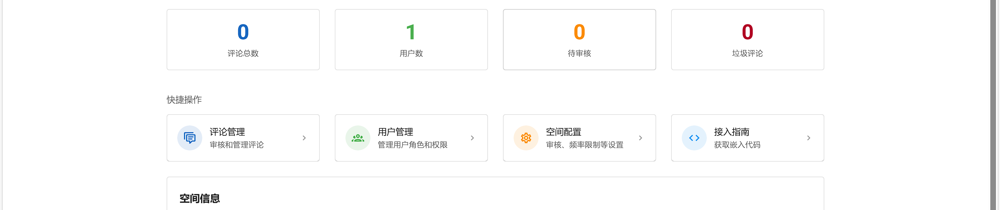
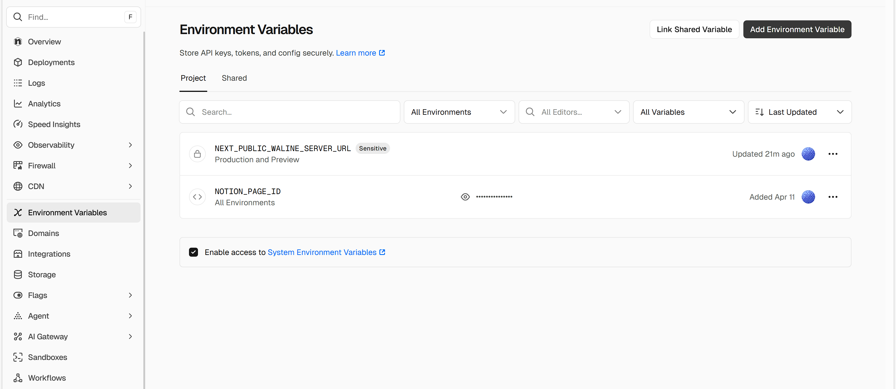

<aside>
😋 我想为这个博客添加评论功能。此前曾关注过 Valine ，但因其部署繁琐最终放弃。但现在有了一个相当简便的方案。

</aside>

<aside>
💡

在 NotionNext 的 [Waline 部署文档](https://docs.tangly1024.com/article/notion-next-waline) 里，我发现了 Valine 的全新替代品 Waline 。

</aside>

<aside>
🤔

随着 [LeanCloud 停止对外提供服务](https://docs.leancloud.app/sdk/announcements/sunset-announcement/) ，文档里的部署方法已经不再适用。但我在 Waline 官网的评论区发现了一个可用的托管服务。

</aside>

# 开始吧

1. 注册并登录 [ZeroCat](https://waline.wuyuan.dev/) 。感谢 [孙悟元](https://wuyuan.dev/) 。
2. 创建一个评论空间。进入所创建的空间，选择接入指南。进入后，复制 Waline 服务端地址。

1. 登录 Vercel 。进入 NotionNext 的 Environment Variables 选项卡，点击上方的 Add Environment Variable 。在 Key 处 填写 `NEXT_PUBLIC_WALINE_SERVER_URL` 在 Value 处粘贴刚才复制的 Waline 服务端地址。完成后重新部署网站即可。

经过上面的操作，NotionNext 就成功接入了 Waline 评论插件，不需要任何复杂配置。
