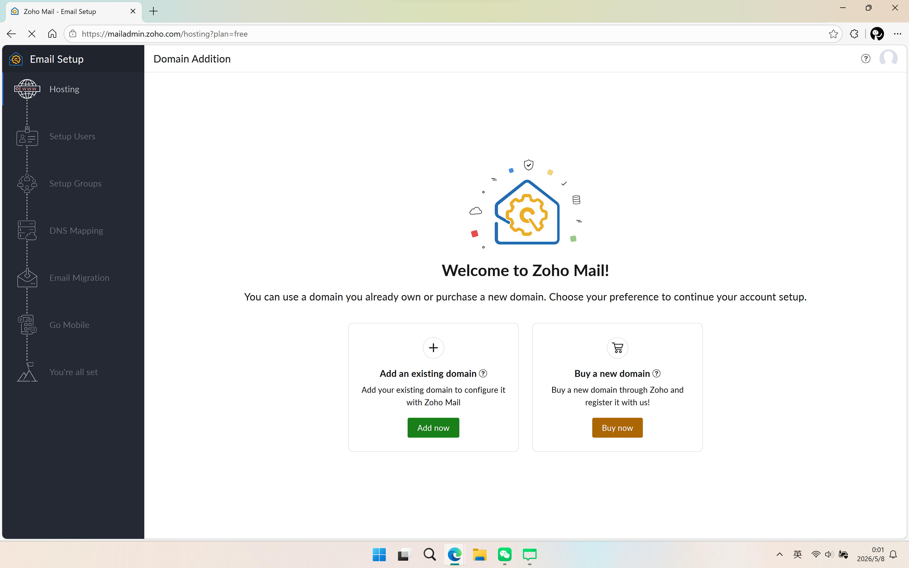
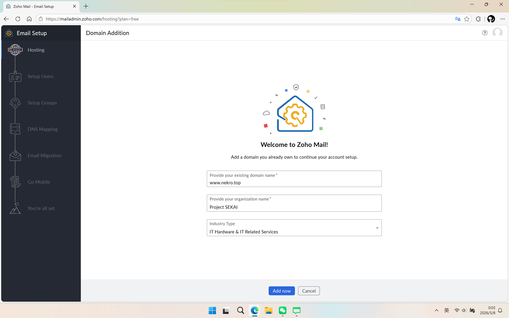
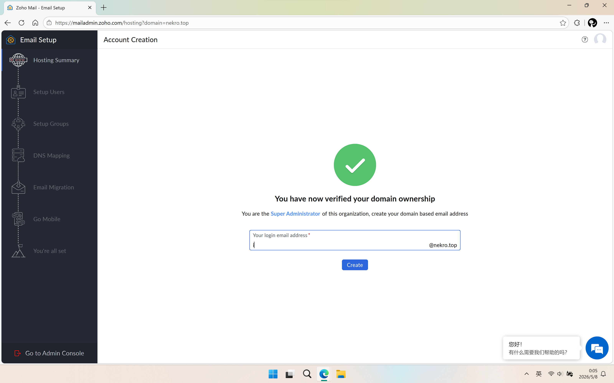
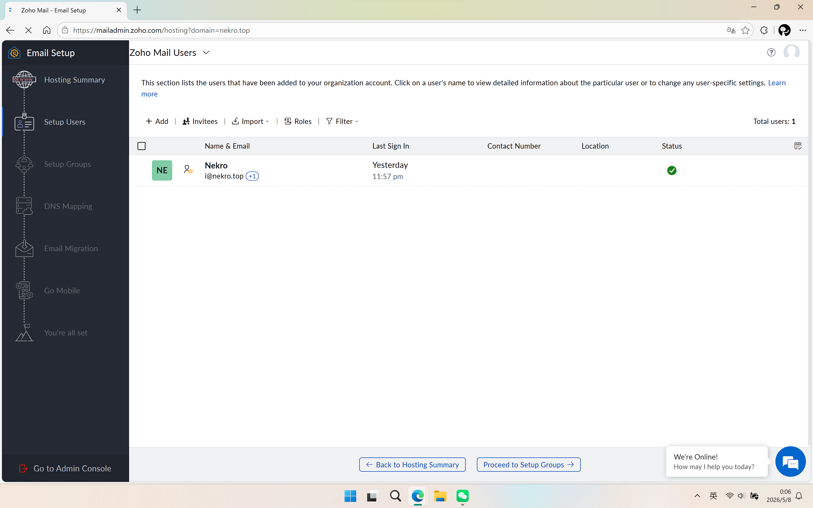
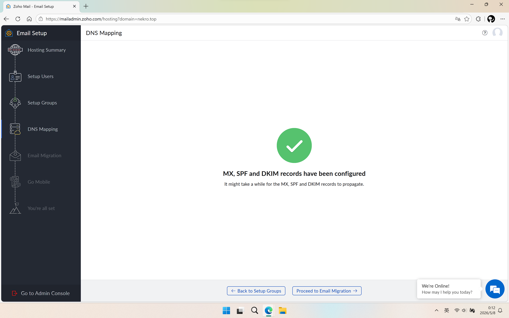
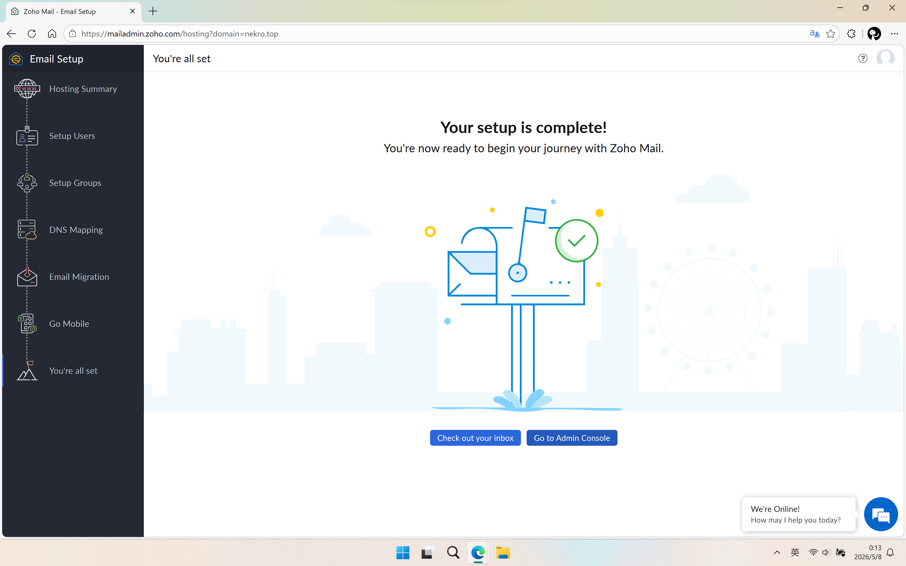
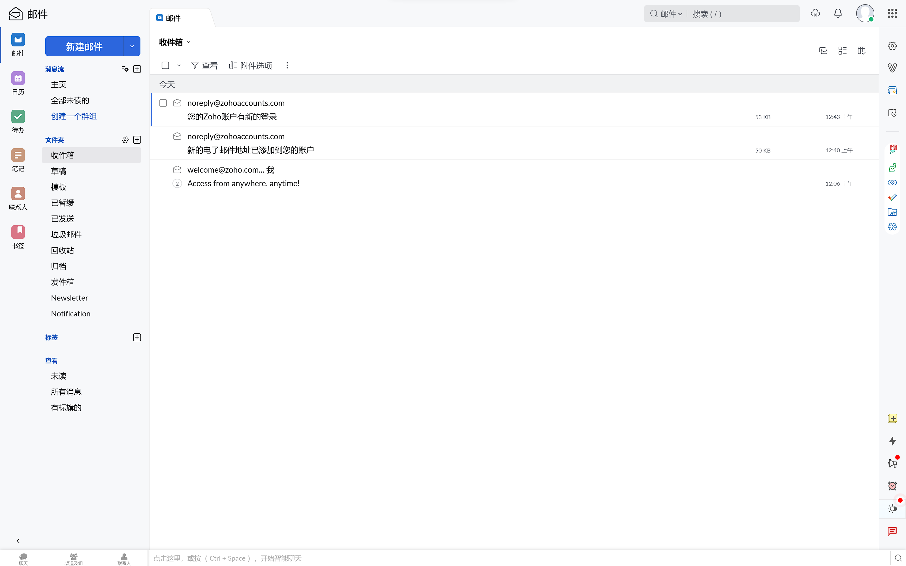

<aside>
😕 我看不惯自己的 Gmail 邮箱前缀，但一直没有办法进行修改。且个人不大喜欢用 Outlook ，尝试用 Cloudflare 邮件转发到 Outlook 时出现了漏邮问题，我迫切需要一个能自定义域名的邮件收发系统，于是我发现了 Zoho 。

</aside>

<aside>
🤔

不过 Zoho 的免费方案也存在一些问题，不支持 IMAP 和 POP 协议，这也就意味着要收发邮件必须使用它的网页或者客户端。不过只要能够便捷地收发邮件，这对我来说就是小问题。

</aside>

# 前提条件

- 一个可用的一级域名
- 可用的解析服务商 (如: Cloudflare、DNSPod 等)

# 开始吧

1. 在 [Zoho 的免费计划页面](https://workplace.zoho.com/signup?type=org&plan=free) 注册一个免费账号 (建议直接进行跳转，官网的入口不好查找)。
2. 注册完成后，根据 [配置页面](https://mailadmin.zoho.com/hosting?plan=free) 指引完成基础配置即可。可以跳过部分非必要配置。

点击 Add now 添加自己的域名

第一项填写自己的域名 其余可随意填写

按照指示验证地址 以上为成功页面 在此填写想要的邮件前缀

后续 Setup Groups 等步骤可选择性跳过 (Proceed to ……)

在 DNS Mapping 一步填写配置 MX, SPF (DKIM 可不配置)。

完成初始配置

1. 上述配置完成后，便可直接用前面注册的账号登录 [Zoho 收件箱](https://mail.zoho.com/zm/#mail/folder/inbox) 。可视作一般的邮件平台使用。

在线网页预览 也可在手机上安装 Zoho Mail 实现相同功能
