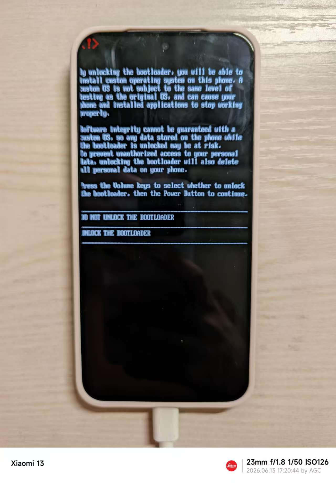
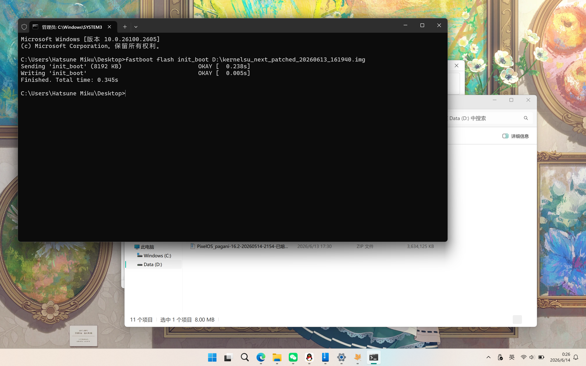
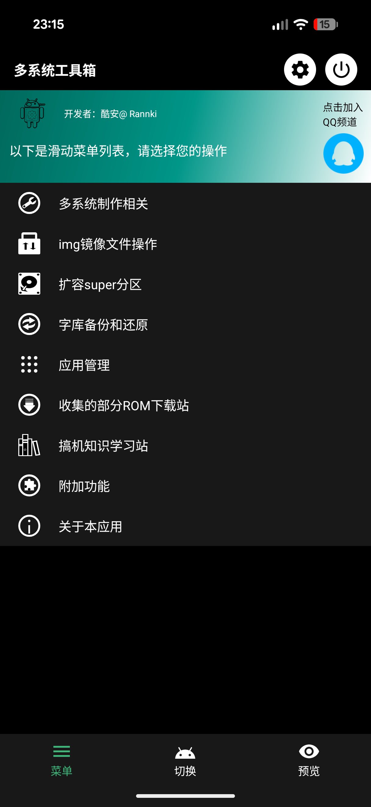
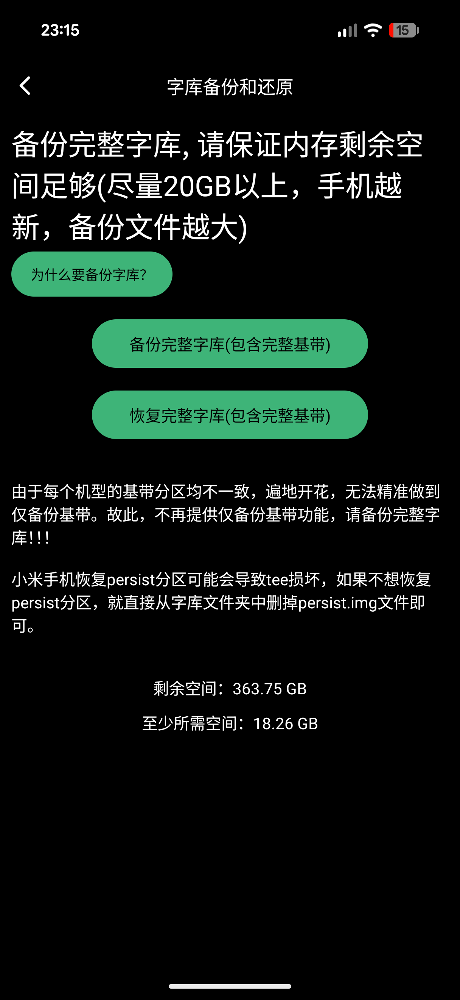
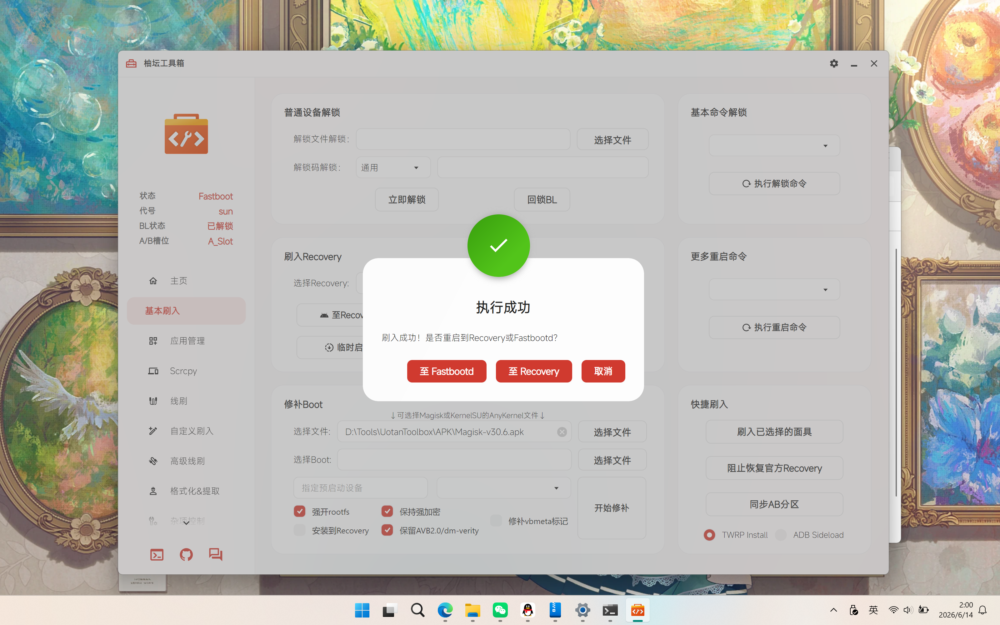
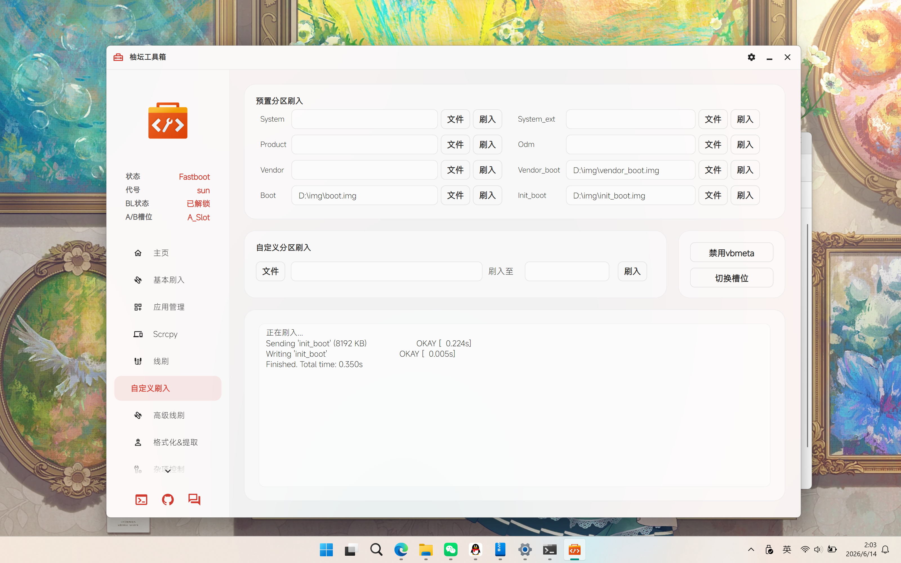
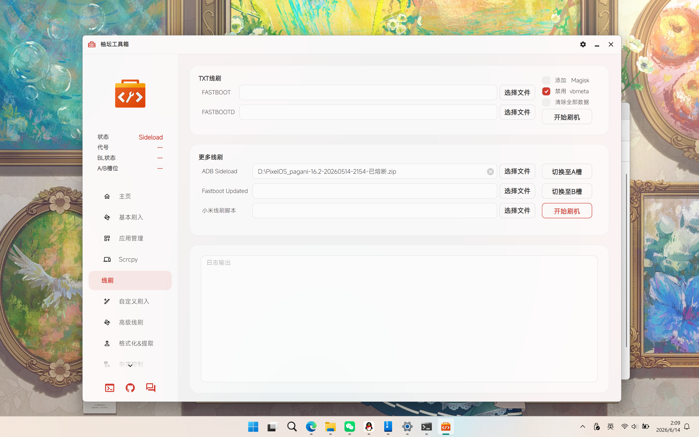
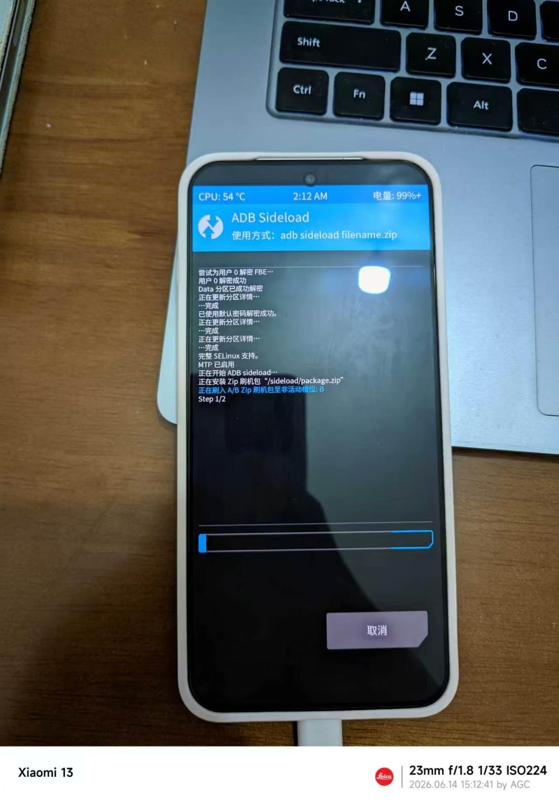

# 前言

~~高考完了，想着换台手机奖励一下自己。但预算不是很高就入了这台 13T。~~

这篇文章会介绍从购买设备到刷入 PixelOS 与系统优化的全过程，部分步骤可以自行省略。

刷机有风险，开始前请自行做好数据备份及退出 Google 账号，操作不当出现的问题后果请自行承担。

# 下载

[123云盘](https://1817491446.share.123865.com/123pan/kCTTjv-G5nuH)

# 致谢

[酷安 @不给叫在线P什么什么交易了 编译的系统包](https://www.coolapk.com/feed/71823213?s=MWFhMmY3NGMyNjk4NDlnNmEzMmQ2Nzd6a1430&shareUid=2529353&shareFrom=com.coolapk.market_14.3.0)

[一加ACE3刷类原生教程（第四次修订）](https://www.kdocs.cn/l/cvkFhkEzLgwZ)

# 步骤

## 解锁 Bootloader

<aside>
📐

若你的设备当前处于 ColorOS 16 及以上版本，请先通过深度测试方可进行下面的步骤。深度测试安装包可在[链接](https://bbsstatic.oneplus.com/public/apk/%E6%B7%B1%E5%BA%A6%E6%B5%8B%E8%AF%95.apk)下载。

也可以选择前往售后降级，携带包装盒或购买凭证前往降级 ColorOS 15 不会收取任何费用。我便是直接到售后降级至 ColorOS 15 了。

</aside>

<aside>
❌

解锁 Bootloader 会清空设备所有数据，请自行做好数据备份。

</aside>

首先前往 `设置 > 关于本机 > 版本信息` 连续点击 7 次 `版本号` 以启用开发者选项。

而后在 `设置 > 系统与更新 > 开发者选项` 中打开 `OEM 解锁` 及 `USB 调试` 。

将设备按电源 + 音量减键重启至 Fastboot 模式后，连接电脑，在电脑上使用 [柚坛工具箱](https://toolbox.uotan.cn/) 或 [秋之盒](https://atmb.top/) 等工具箱来执行 ADB 命令，后文将使用柚坛工具箱以简便操作。点击柚坛工具箱左下角的命令图标打开终端，输入命令: `fastboot flashing unlock` 后，按音量下键选择 `UNLOCK THE BOOTLOADER` 即可成功解锁。

解锁 Bootloader

## 提取并刷入修改后的 init_boot

<aside>
⚠️

注意: init_boot 文件必须和当前手机的系统版本相对应，否则不开机。

</aside>

若您当前的系统版本高于 `16.0.5.701`，请在 [大侠阿木云盘](https://yun.daxiaamu.com/) 下载您当前对应系统版本的完整包后，使用手机的 [MT管理器](https://mt2.cn/) 打开完整包的 `payload.bin`，即可看到 `init_boot.img`，将其提取到手机内置存储。

若您当前的系统版本大于或等于 `16.0.3.501` 且小于 `16.0.5.701` (已熔断)，请先使用我链接中发的完整包进行本地更新，更新两次，确保 A/B 槽中为相同的系统。若你当前正处于 `16.0.5.701`，保险起见也请使用完整包进行一次系统更新。本地更新默认不开放，需要断网且打开开发者选项后，进入 `设置 > 应用管理` 中，右上角三点显示系统应用，搜索软件更新并清除其数据。即可在系统更新页面出现本地更新选项。为防止跳步，网盘中没有上传此版本的 `init_boot`。同样的，从完整包中提取 `init_boot.img` 另行保存。

若您仍处于 C15 或 C16 的早期版本，仍然建议手动确认一遍熔断状态，检测方法后面会提供。熔断过 9008 的设备与未熔断的设备使用的刷机包略有不同。按照前文提及的步骤提取当前版本 `init_boot.img`。

提取完成后，下载任意一个 Root 管理器 (这里使用 [KernelSU-Next](https://github.com/KernelSU-Next/KernelSU-Next/releases))，将 `init_boot` 文件放入其中进行修补。修补完成后传给电脑等待刷入。

将手机重启至 Fastboot 模式，在终端输入命令: `fastboot flash init_boot (后接你提取出的init_boot 文件)` 

待刷入成功后重启系统，安装管理器即可。

刷入 init_boot.img

<aside>
⚠️

检查设备是否熔断 9008: 按上文修补 init_boot 后，下载安装 [OnePlus ARB Checker](https://f-droid.org/packages/com.bartixxx.oneplusarbchecker/)，并授予 Root 权限。打开便可以自行查询 9008 熔断状态。如图所示即为已熔断的设备，若你需要保有 9008 授权刷入 PixelOS，请在酷安自行搜索保 9008 升级的办法并升级至 16.0.5.701。

</aside>

## 备份字库

<aside>
ℹ️

这不是一个必备操作，但也许能够在关键时候救命。前面 Root 设备主要也是为了这一步。

</aside>

在手机上下载并安装多系统工具箱，并使用管理器为其授予 Root 权限。

打开多系统工具箱，过完引导后进入 `菜单 > 字库备份与还原 > 备份完整字库` 来备份字库。

备份完成后，把它在内部存储生成的 `Rannki` 文件夹复制至电脑，以备不时之需。

多系统工具箱

备份字库

## 刷入 TWRP

<aside>
😀

有大佬专门为 13T 编译了 TWRP，实测可以正常使用。文件已上传在文章开头的云盘链接。

</aside>

<aside>
🫥

我将使用 TWRP 进行 ADB Sideload 线刷。如果使用 PixelOS 的 Recovery 会出现签名问题导致无法刷入，且重启后会进入 900E 模式，非必要请勿尝试。

</aside>

将手机重启至 Fastboot 模式。电脑打开柚坛工具箱，检查设备连接状态。正常连接设备后进入 `基本刷入 > 刷入 Recovery`，在选择 Recovery 处选择 TWRP 的 img，刷入即可。

刷入 Recovery

刷入后先不急着重启至 Recovery 模式。在柚坛工具箱选择 `自定义分区刷入 > 预置分区刷入`。依次刷入 Vendor_boot、Boot、init_boot。刷入完成后请留意一下当前 Fastboot 下显示的槽位并记录 (我这里是 A 槽 后面会用)，之后在柚坛工具箱主页将设备重启至 Recovery 模式。

刷入 Vendor_boot、Boot、init_boot

## 进入 TWRP 刷包

<aside>
⚠️

此步为关键步骤，请勿大意。

</aside>

在 TWRP 中，依次进入左下角 `高级 > ADB Sideload`，并勾选清除 Dalvik Cache/Cache，滑动进入 ADB Sideload 模式。

TWRP > 高级

在柚坛工具箱选择 `线刷 > 更多线刷`，在 ADB Sideload 一栏选择 PixelOS 的刷机包开始刷机。电脑端输出大约会在 47% 左右结束，是正常现象。待手机上显示刷入完成后点右下方重启系统。点击后立即按住音量下键进入 Fastboot 模式。

柚坛工具箱 > 更多线刷

ADB Sideload

在 Fastboot 模式下，在柚坛工具箱查看当前的槽位状态，正常来说这时候会更换一次启动槽位。请检查是否与初次进入 Fastboot 时的槽位不同。若仍然是原来槽位 (A)，请执行 `fastboot set_active b` 手动切换槽位 (若本来在槽位 B，就将 b 改为 a)。

检查完毕后，再次刷入 TWRP 并重启至 Recovery 模式，重复上文的操作再进行一次 ADB Sideload 来刷入 PixelOS。刷完后先不点击重启。返回 TWRP 主页，执行 `清除 > 格式化 data 分区` 后再通过 TWRP 的重启选项重启至系统。

至此，我们便成功刷入了 PixelOS，若需获取 Root 权限，只需将 PixelOS 文件夹中的 init_boot.img 放进管理器修补即可。至于系统方面的优化以及环境隐藏，我将另外发布一篇文章细说。
