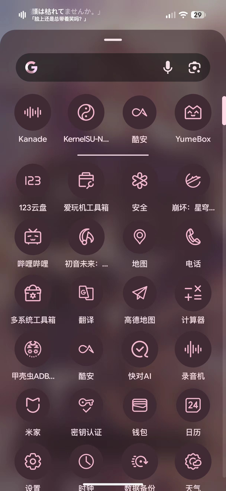
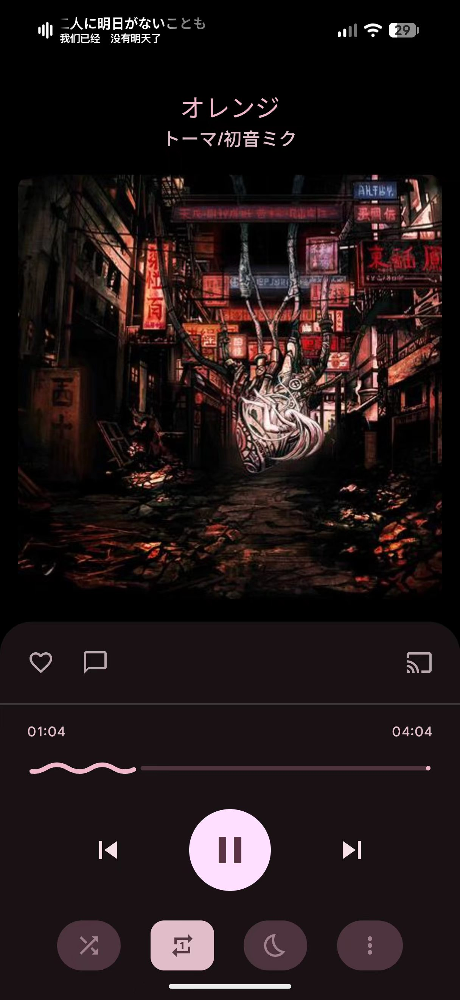
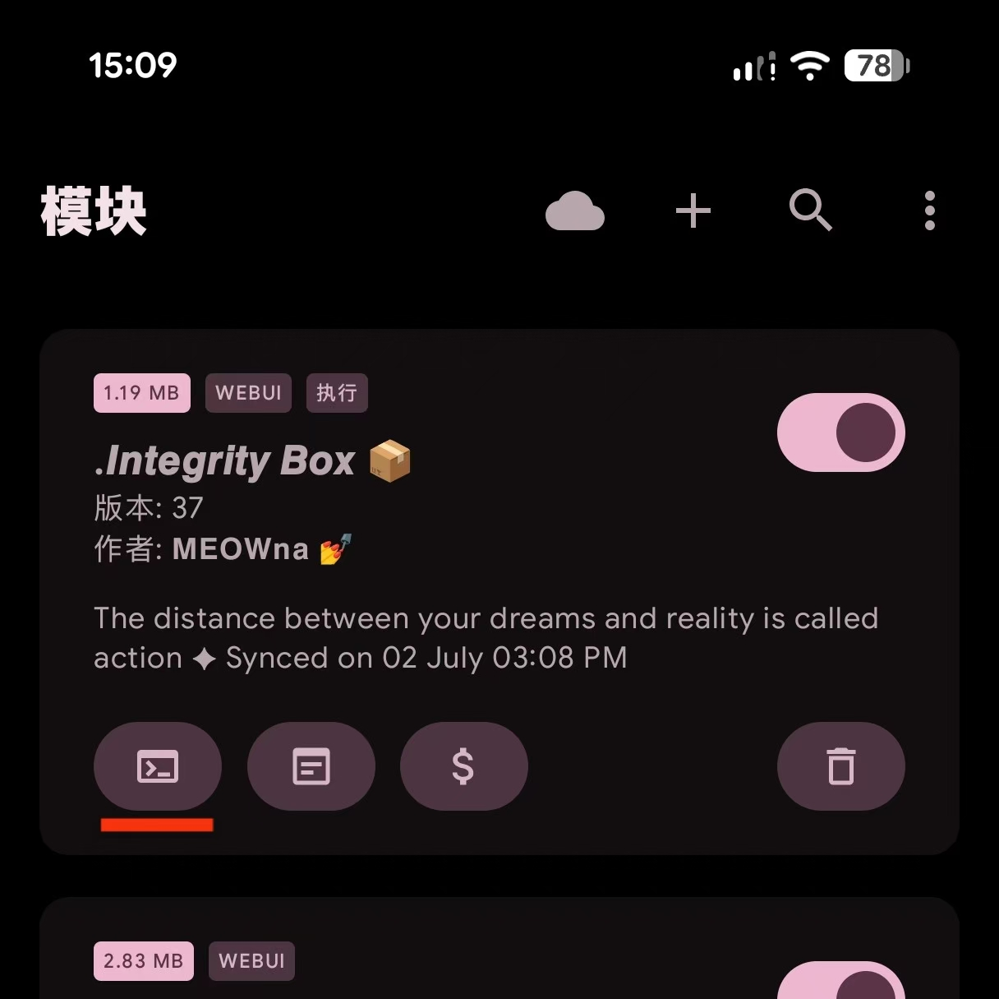
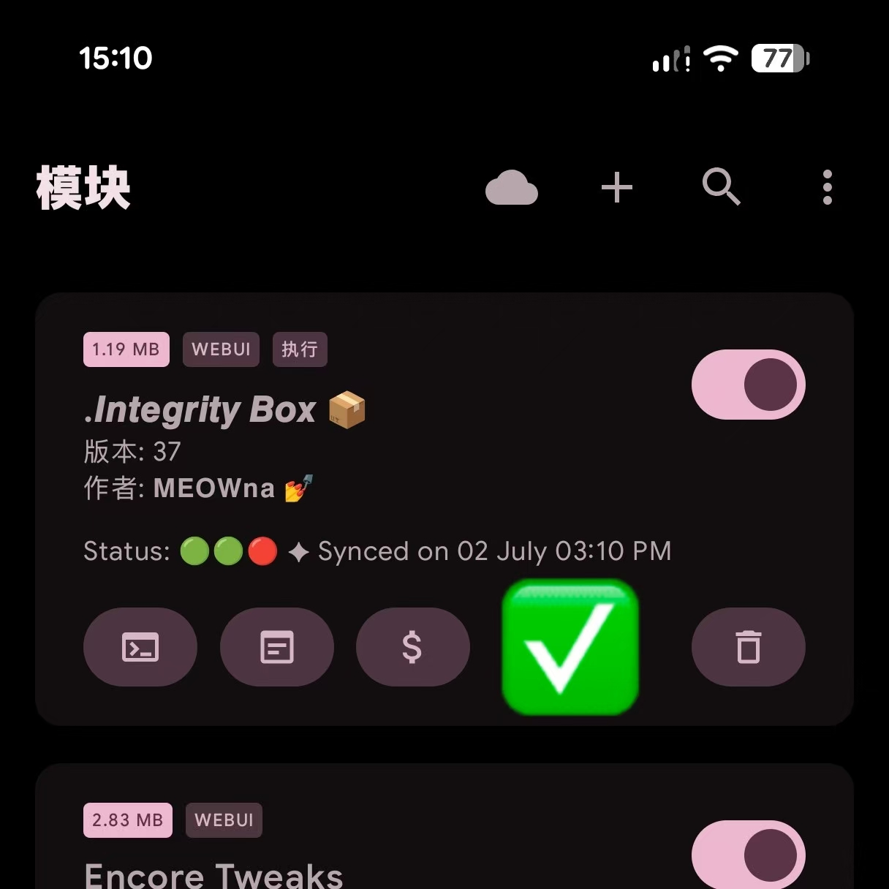

# 前言

在上一篇文章中，我已经将手上这台一加 13T 刷入了 PixelOS 系统。

它的好处就是带来了接近于真正 Pixel 的系统体验，开机引导、谷歌账号登录等环节都比我之前刷的类原生有所不同，令人眼前一亮。但在实际使用的时候，它给我的感受就不是很美好了。缺少了一些我在其它类原生 ROM 上可以看到的功能，我将尝试动手补齐这些东西。

# 启动器美化

PixelOS 使用的是 Pixel 启动器。好处是与谷歌服务完美融合，而坏处便是自定义程度很低。我此前刷入的两个基于 A16 的类原生，都能够在应用抽屉中隐藏自己不想看见的 App，以及启用带主题的图标。但是 PixelOS 并不包含这样的功能，所以我们需要模块来对启动器进行一些修改。

我比较喜欢的图标包是 [Lawnicons](https://github.com/LawnchairLauncher/lawnicons)，这里就介绍如何将其套用到 PixelOS 的桌面与应用抽屉。

我这里使用 [Pixel Launcher Mods](https://github.com/KieronQuinn/PixelLauncherMods) 和 [全局图标包](https://github.com/RichardLuo0/global-icon-pack-android) 更换系统图标。前者只需 Root 权限，后者需要 LSPosed 框架支持。至于为什么需要两个，原因也很简单，前者无法更换时钟与日历的图标，而后者无法对未适配的应用套用已有图标，导致整体风格相当不统一。把二者结合使用便可极大改善桌面与应用抽屉的观感。

实际效果预览

# 状态栏歌词

我此前用 Flyme 系统时，最吸引我的特色功能莫过于小窗和状态栏歌词。我目前没有找到合适的小窗替代品 (米窗的使用方式还是过于繁琐了)，但状态栏歌词还是可以复刻的。

在 [墨 - 状态栏歌词](https://github.com/Block-Network/StatusBarLyric) 停更后，目前主流且适配较好的方案是 [词幕](https://github.com/tomakino/lyricon)。其适配了一众主流播放器的同时，也对某些第三方播放器有着良好的支持。我目前使用的 [NeriPlayer](https://github.com/cwuom/NeriPlayer) 与 [Kanade](https://github.com/rcmiku/Kanade) 都有针对次幕进行适配。使用体验良好。

词幕 + Kanade

# 杂项配置

## 调度调节

我当前使用的是 [Encore Tweaks](https://github.com/Rem01Gaming/encore)，它旨在最大化设备游戏性能，同时在日常使用中智能保持电池寿命。实际使用效果还算可以，日常使用的耗电确实好了不少，但是打烤有时会遇到大大小小的卡顿。如果有游戏需求我还是更推荐 [Uperf Game Turbo](https://github.com/yinwanxi/Uperf-Game-Turbo) 搭配 Scene 对各个应用的调度进行动态配置。

## 音效优化

我目前使用的是 [JamesDSP](https://github.com/james34602/JamesDSPManager)，可试了下可以用但效果聊胜于无。

可惜 ViPerFX 不支持骁龙 8E 以上的处理器，个人还是更喜欢蝰蛇音效一些。

## 字体更换

PixelOS 并没有全局使用 Google Sans 字体，在很多第三方应用里依旧使用 Noto Sans，并且其对中文的支持也相当糟糕。

要替换只需要找一个适合自己的字体模块并刷入即可 (如果你使用了 Zygisk Next 作为 Zygisk 注入器 那么需要先安装 Fontloader 模块 可见 Zygisk Next 1.3.0 的更新日志)。

# 环境隐藏

目前我试过唯一能在这个系统上实现 Play Integrity 三绿的模块是 [Integrity-Box](https://github.com/MeowDump/Integrity-Box) (虽说一股 Vibe Coding 味但是确实有用 不过我看到有人在老设备用这个模块会导致黑砖?)。只需要刷入 Tricky Store 的类似物后 (我这里使用 [TEESimulator-RS](https://github.com/Enginex0/TEESimulator-RS))，刷入这个模块并手动点击一次运行，它就会自动从云端匹配最适合设备的密钥。

*2026.07.02: 目前用这个模块似乎只能实现二绿，不过也足够日常使用了。希望模块后续更新可以实现三绿吧。

